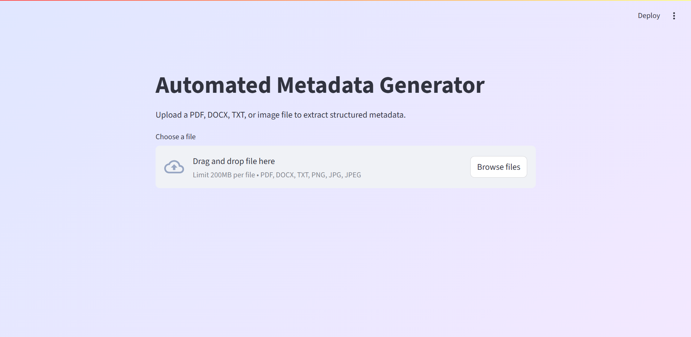
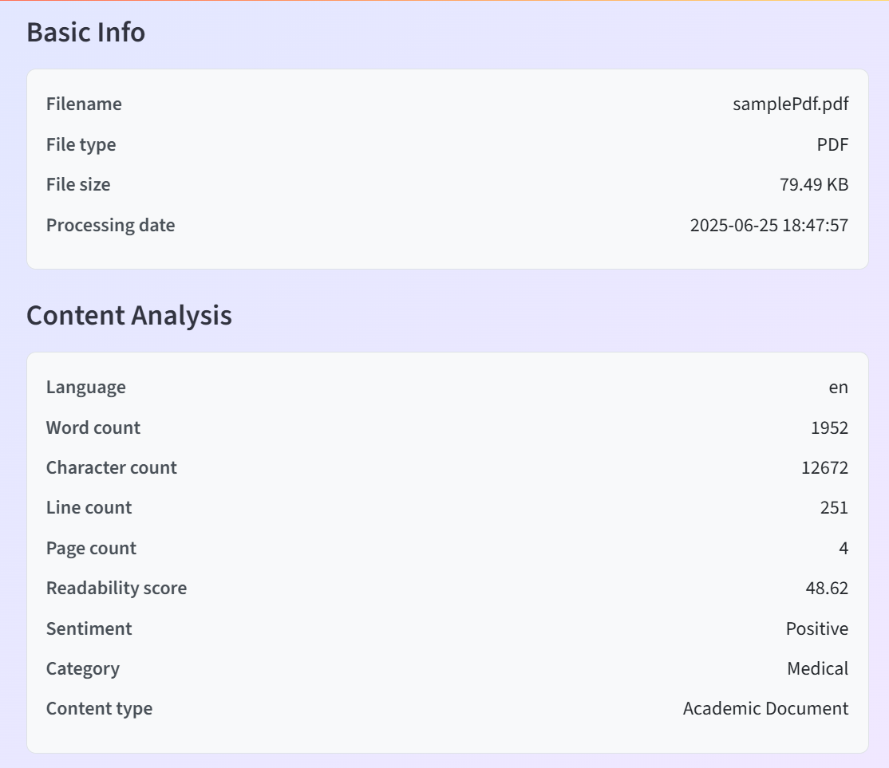
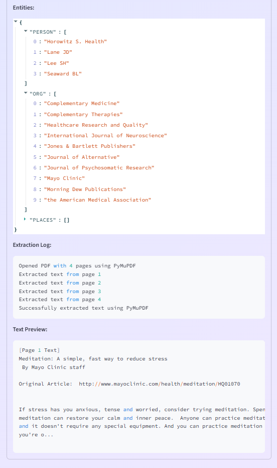

# Automated Metadata Generator

A modern, user-friendly web app for extracting rich metadata and semantic information from PDF, DOCX, TXT, and image files. Built with Streamlit and Python, this project is ideal for document analysis, academic work, and automated content understanding.

---

## Screenshots

### Main Interface


### Metadata Display
<table>
  <tr>
    <td align="center"></td>
    <td align="center"></td>
  </tr>
</table>


---

## Features
- **File Upload:** Supports PDF, DOCX, TXT, PNG, JPG, and JPEG files.
- **Automated Metadata Extraction:**
  - Basic file info (name, type, size, processing date)
  - Content analysis (language, word/character/line/page count,Readibility Score, sentiment, category, content type)
  - Semantic data (summary, key topics, key phrases, named entities: PERSON, ORG, PLACES)
- **Modern UI:** Clean, professional, and easy to use with a subtle gradient background.
- **No HTML/CSS required:** All UI is built with Streamlit's native components.

---

## Supported File Types
- PDF (.pdf)
- Word Document (.docx)
- Text File (.txt)
- Images (.png, .jpg, .jpeg)

---

## 🛠️ Requirements
- Python 3.8+
- [Tesseract OCR](https://github.com/tesseract-ocr/tesseract) (for image/PDF OCR)
- [Poppler](http://blog.alivate.com.au/poppler-windows/) (for PDF to image conversion)
- All Python dependencies in `requirements.txt`

---

## Setup Instructions

### 1. Clone the repository or copy the project files

### 2. Create and activate a virtual environment (recommended)
```bash
python -m venv venv
# On Windows:
venv\Scripts\activate
# On Mac/Linux:
source venv/bin/activate
```

### 3. Install Python dependencies
```bash
pip install -r requirements.txt
```

### 4. Install Tesseract OCR
- **Windows:** [Download installer](https://github.com/tesseract-ocr/tesseract/wiki/Downloads)
- **Linux:** `sudo apt-get install tesseract-ocr`
- **Mac:** `brew install tesseract`

### 5. Install Poppler
- **Windows:** [Download binaries](http://blog.alivate.com.au/poppler-windows/), add `bin/` to your PATH
- **Linux:** `sudo apt-get install poppler-utils`
- **Mac:** `brew install poppler`

### 6. Download the spaCy English model
```bash
python -m spacy download en_core_web_sm
```

---

## Running the App
```bash
streamlit run streamlit_app.py
```
- The app will open in your browser at `http://localhost:8501`

---

## Usage Instructions
1. **Upload a file** using the uploader at the top.
2. **View extracted metadata** in three sections:
   - Basic Info
   - Content Analysis
   - Semantic Data (expandable)
3. **Copy or analyze** the results as needed.

---

## Project Structure
```
├── metadata_generator.py      # All extraction and analysis logic
├── streamlit_app.py           # Streamlit web app UI
├── requirements.txt           # Python dependencies
├── README.md                  # This file
├── venv/                      # (optional) Python virtual environment
├── screenshots/               # (optional) Screenshots for README
```

---

## Customization
- **Add more metadata fields:** Edit `metadata_generator.py`.
- **Change UI layout:** Edit `streamlit_app.py` (uses only Streamlit native components).
- **Change background gradient:** Edit the CSS in `streamlit_app.py`.

---

### Troubleshooting
- **Tesseract/Poppler not found:**
  - Ensure they are installed and their paths are added to your system PATH.
- **spaCy model error:**
  - Run `python -m spacy download en_core_web_sm`.
- **File upload issues:**
  - Check file type and size limits.
- **Other errors:**
  - Check the terminal for error messages and ensure all dependencies are installed.

---

## 📣 Credits
- Built with [Streamlit](https://streamlit.io/), [spaCy](https://spacy.io/), [NLTK](https://www.nltk.org/), [PyMuPDF](https://pymupdf.readthedocs.io/), [Tesseract OCR](https://github.com/tesseract-ocr/tesseract), and more.
